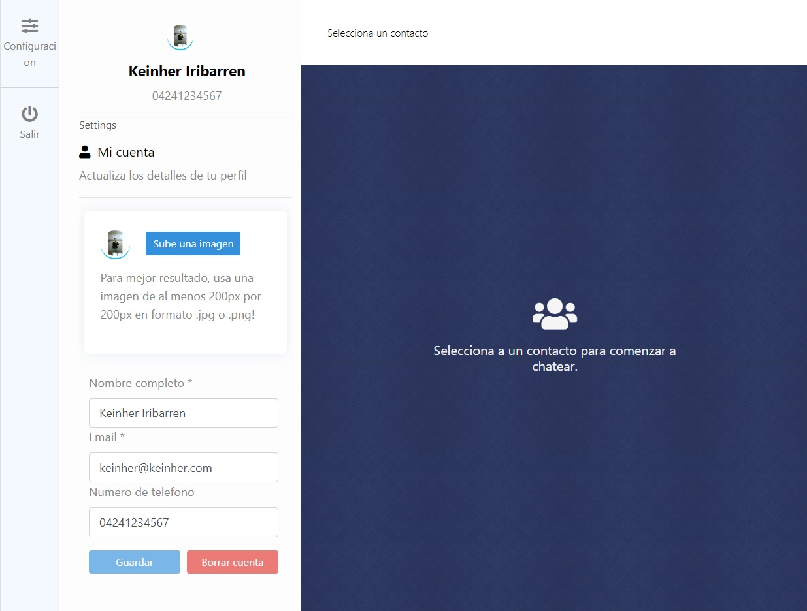

Chatapp with LARAVEL and VUEJS

    
    
    

## About this project

This chatapp was made for practice with the technologies like VueJS and Laravel, this is not a API REST, but is no reload web.
git
## Principal features of this Chat aplication

I implemented many features to this project to make more comlex for learning proposities. The features are listed in:

- Login and register.
- Laravel Echo implemented, with live events.
- Messages can mark as read.
- Configuration section for the user data.
- Upload and change profile images.
- List of users, with search box.
- Default images for new registered users.
- Very metodic validations for sended data.
- Very fresh UI desing.
- Feedback messages with alerts and notifications.
- Loading feedback.
- Notifications for recived messages.
- Icons from FontAwesome implemented.

